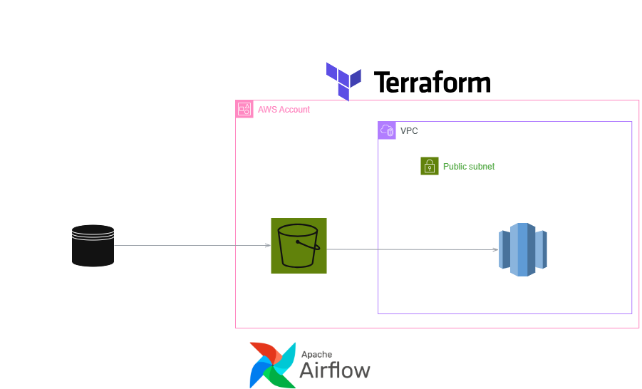

# EcomDataSync - Synthetic E-Commerce ETL Pipeline

This project generates synthetic transaction data, loads it into AWS S3 bukcet. Then it copies the data from S3 bucket into a Redshift Data warehouse. Fully Automated with Apache Airflow and Terraform

## quickstart

1. **Clone the repo**  
   ```bash
   git clone <github-link>
   cd ecomdatasync
   ```

2. Provision AWS infrastructure
   ```bash
   # Navigate to the infrastructure folder
   cd infrastructure
   terraform init
   terraform apply
   ```

3. Build & deploy Airflow
   ```bash
   # Navigate to the airflow folder
   cd ../airflow

   # Deploy airflow
   docker compose up airflow-init
   docker compose up -d
   ```

4. Start the DAG
   + Open the Airflow UI on `http://localhost:8080`
   + Unpause daily-ecomm-transactons-etl-v1 for your first run

## Architecture



**Airflow DAG Orchestrates**  
+ Synthetic Data Source : A Python script (in `airflow/transactions_utils.py`) generates 500_000 to 1_000_000 synthetic transactions
+ Loads the synthetic data into S3 as a parquet file
+ Use COPY from S3 to Redshift via S3ToRedshiftOperator

**AWS Infrastructure**
+ Provisioned by Terraform:
  + VPC (public subnet, IGW, route tables, security group, etc)
  + IAM user with S3 write permissions - This user was used by airflow to write generated data to s3
  + IAM Role with S3 read permissions for Redshift COPY - This role was assigned to the redshift cluster
  + Secrets Manager for storing Redshift admin credentials
  + Redshift Cluster

## Sub-Folder Readmes

The `airflow` and `infrastructure` folders have their respective READMEs with their detailed setup
+ [Infrastructure Setup](./infrastructure/README.md)
+ [Airflow Setup](./airflow/README.md)