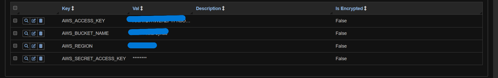
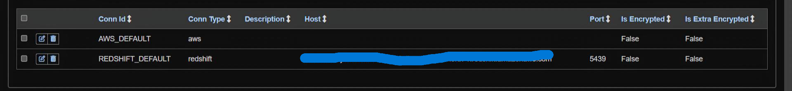
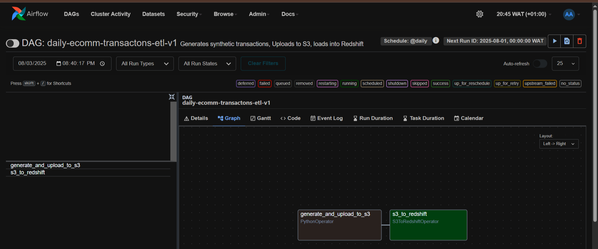
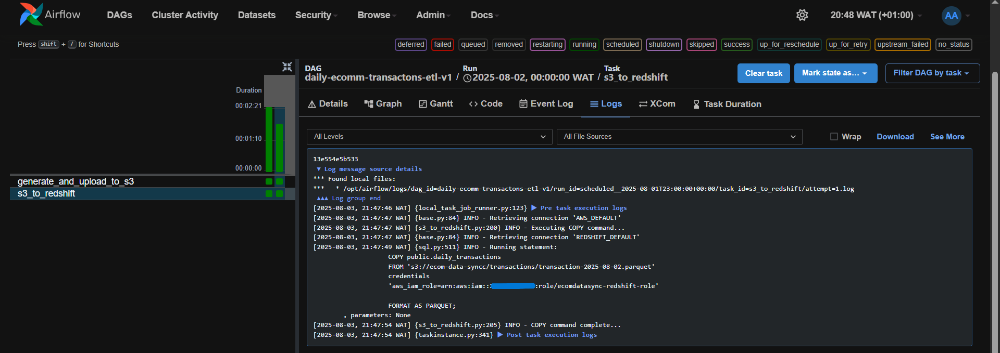
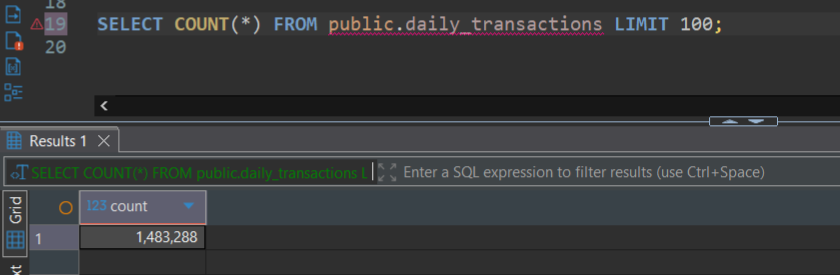
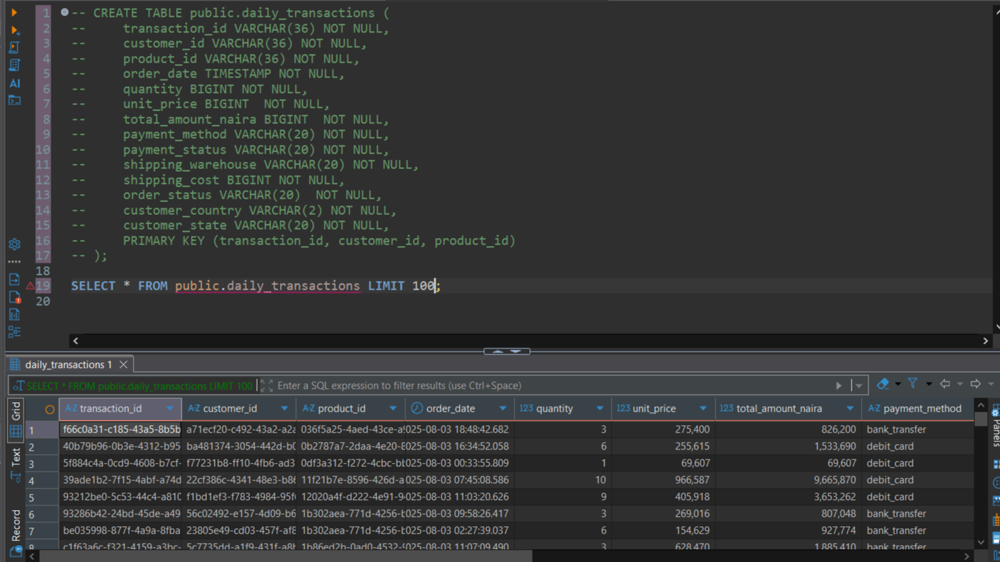

# Airflow

Orchestrates the EcomDataSync ETL i.e. Generates Synthetic Transactions, upload to S3 as Parquet, copy into Redshift.

## Folder Structure

```
.
├── Dockerfile
├── docker-compose.yaml
├── requirements.txt
├── config
├── dags
│   ├── aws_utils.py
│   ├── pipeline.py
│   └── transaction_utils.py
├── logs
├── plugins
└── README.md
```

## Variables and Connections

### Variables
Some variables are needed to be provided in the Airflow UI get the DAG working properly

| Environment Variable | Description |
| - | - |
| `AWS_BUCKET_NAME` | Name of the S3 bucket where the synthetic data will be uploaded to as Parquet files |
| `AWS_ACCESS_KEY_ID` | AWS access key ID for the IAM user - This access Key is used by Airflow to push the generated data to S3 bucket -  Provisioned by Terraform in [infrastructure/iam.tf](../infrastructure/iam.tf) |
| `AWS_SECRET_ACCESS_KEY` | AWS secret access key for the IAM user - This secret Key is used by Airflow to push the generated data to S3 bucket - Provisioned by Terraform in [infrastructure/iam.tf](../infrastructure/iam.tf) |
| `AWS_REGION`| AWS region where both the S3 bucket and Redshift cluster reside (Both of them be same to allow the Redshift `COPY` command to succeed i.e. you must create both the bucket and the cluster in the same region for copy command to succeed) |



### Connections

Some connections are also needed 

| Connection | Description |
| - | - |
| AWS_DEFAULT |  Airflow connection of type `Amazon Web Services` - It holds AWS Role used by `S3ToRedshiftOperator` to read from S3 |
| REDSHIFT_dEFAULT | Airflow connection of type `Amazon Redshift` - It holds the cluster's connection details(i.e.endpoint, port,database name, username and password) t, used by `S3ToRedshiftOperator` (`redshift_conn_id`) to load data into Redshift. | 




## DAG Overview and report

### Daily E-Comm Transactions ETL

**DAG**
  + DAG ID : `daily_ecomm_transactions_etl_v1`
  + Schedule Interval - `@daily`

**Tasks:**
  + `generate_and_upload_to_s3` – generate & upload Parquet
  + `s3_to_redshift` – COPY into Redshift



### Sample Run



### Confirm that the task was successful



---

